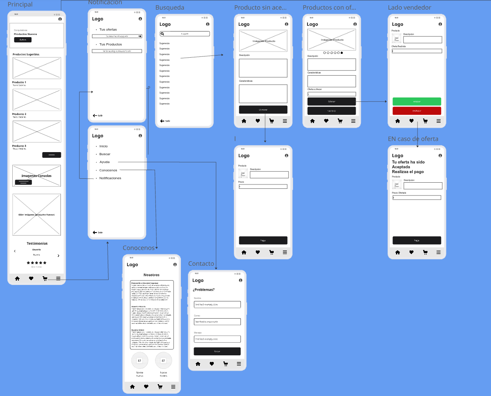
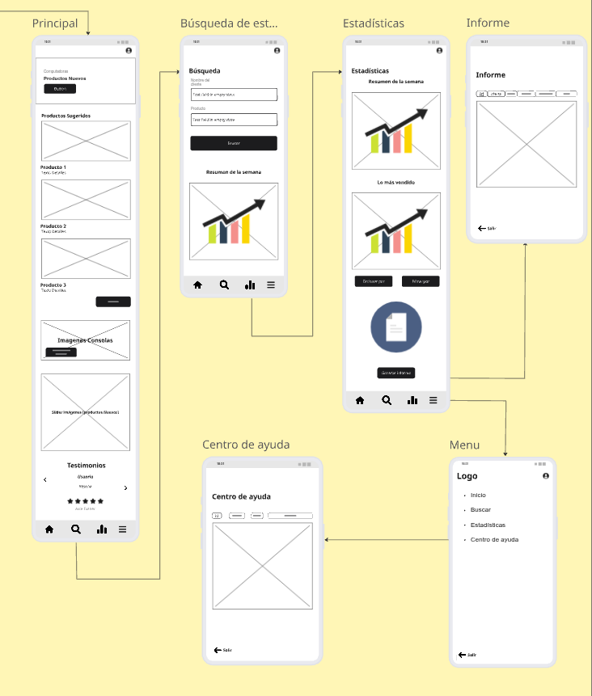
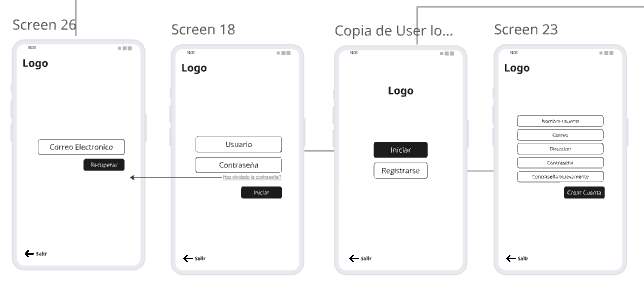

# Integrantes: 
## Brandon Yañez y Anthony Adasme

---

# BarGaming - Proyecto Android

Aplicación móvil desarrollada con **Kotlin** y **Jetpack Compose** para la gestión de productos, usuarios y compras en el ecosistema BarGaming.

---

## Tecnologías principales

- Android Studio (Kotlin)
- Jetpack Compose
- Material 3
- MVVM + Navigation
- Spring Boot (Backend)
- Oracle DB (Base de datos)

---

## Estructura general

- `MainActivity.kt` → Punto de entrada
- `MyApp.kt` → Define el tipo de interfaz (Compact / Tablet)
- `AppNavGraph.kt` → Control de navegación y estructura visual
- `ui/screens/` → Pantallas principales
- `ui/components/` → Componentes reutilizables

---

## Mockups

---

